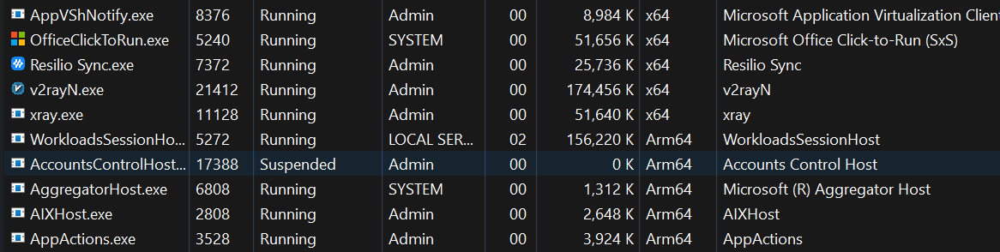
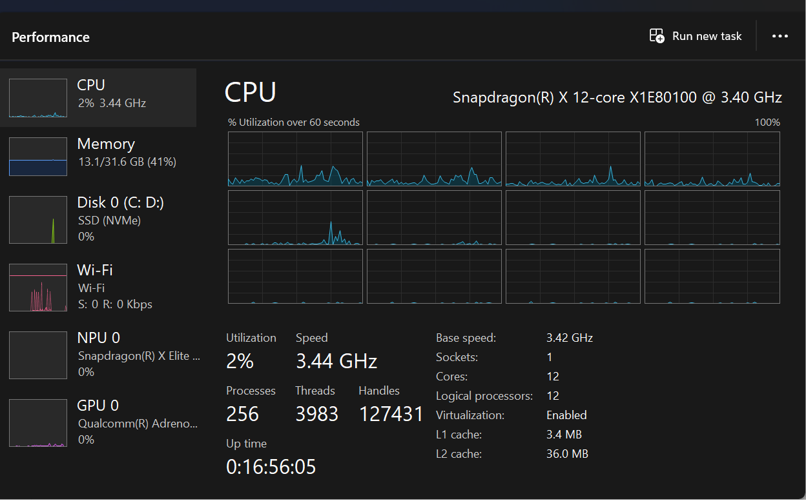

# My Surface 7 ARM Diary

This is my personal experience diary documenting my journey using the Surface 7 ARM and differences I've noticed compared to traditional x64 architecture.

---

## Getting Started - Installation Experience

So I got my hands on a Surface 7 ARM, and honestly, Windows 11 installation was surprisingly smooth. Everything felt very familiar - almost exactly the same experience as installing on x64 systems. No major hiccups or complications during setup.

---

## Handheld Experience

Using the Surface 7 ARM in handheld mode has been mostly great, but there's a couple of things worth mentioning.

### What I Love

The device is incredibly thin and light - it's a joy to hold. And the screen? Absolutely beautiful. The display quality is stunning, with vibrant colors and sharp details that make everything look great.

### One Thing to Watch Out For

There's one small issue I've discovered: the edge of the laptop is a bit sharp. Here's the scenario - you're walking into a room or meeting, holding the device with your left palm, and trying to open it with your right hand. That sharp edge can actually catch and cut your finger skin a bit. 

Pro tip: This doesn't happen at all when it's resting on a desk - it's specifically a "walking while opening" situation. So if you're about to make a grand entrance and pop open your Surface mid-stride, maybe pause and find a table first! Your fingers will thank you.

---

## Key Differences I've Noticed

### ARM64 vs x64 - What I See in Task Manager

The first thing that caught my attention was looking at Task Manager. Instead of seeing "x64" for process architecture, I now see "ARM64" everywhere. That's really the main visual indicator that I'm running on ARM architecture.

---

## Hardware Support - What Works and What Doesn't

### My Docking Station Adventures

I tried out a few different docks to see what would work:

**ThinkPad USB-C Dock Gen 2 (40AS)**
- Status: Doesn't work with Surface 7 ARM
- That was disappointing - had to try something else

**ThinkPad Thunderbolt 3 Dock Gen 2 (40AN)**
- Display support: Works perfectly!
- USB peripherals: Works great
- Built-in Ethernet: Haven't tested this yet - need to come back and check this

**HP Thunderbolt G4 Dock (120W)**
- Display support: Works
- USB mouse and keyboard: Works without issues
- Built-in Ethernet: Unfortunately, doesn't work
  - It's using an Intel I225-LMvP Ethernet controller
  - After doing some research, I discovered there's no ARM Windows 11 driver available
  - Seems like this adapter just doesn't have ARM64 driver support

### External Display Experience

I connected my ViewSonic display via USB Type-C and it just worked!

**ViewSonic via USB Type-C:**
- Works well with Surface 7 ARM
- Display recognition was immediate - no waiting around
- Resolution and refresh rate settings all work as expected
- Didn't need to install any additional drivers

### Bluetooth Peripherals

Using my Bluetooth mouse and keyboard has been smooth sailing:

**Mouse & Keyboard:**
- Work as expected with default Windows drivers
- No special setup required

**Logitech Devices:**
- Functionality: Works perfectly, even without Logitech Option+ software
- Here's something interesting - Logitech Option+ doesn't keep popping up asking me to install it on ARM Windows (which is actually nice!)
- I mean seriously, why does mouse software need 1GB+ of disk space anyway?

---

## Software Support - Installation and Experience

### How I Install Software

#### Chocolatey
I noticed that Chocolatey tries to install x64 software by default. But honestly, this hasn't been a problem because:
- The ARM64 emulator can run x64 software without issues
- Most applications work just fine through emulation

#### Winget (My Preferred Approach)
I ended up transforming my installation scripts to use winget instead. I like this better because:
- It automatically grabs Microsoft software with ARM builds whenever possible
- It prioritizes native ARM64 applications over emulated x64 versions
- Overall, it just provides better performance optimization

### Network Analysis Tools

#### Npcap & Wireshark
I was curious if these would work, and to my surprise, both Npcap and Wireshark work really well on Surface 7 ARM:
- Npcap driver installed without any issues
- Wireshark runs smoothly with full packet capture capabilities
- All the network analysis functions work as expected

#### Windows Features on ARM

My laptop came with Windows 11 25H2 (build 26220), and I noticed it has the Recall preview feature enabled. Honestly, I'm not a fan of this feature. No doubt about it. If you want to disable it, just run `appwiz.cpl` and turn it off - that made it go away for me.

I also installed some virtualization features and here are the test results:

**WSL (Windows Subsystem for Linux):**
- Status: Works perfectly!
- Performance: Works exactly like x64
- Compatibility: Seamless operation, no noticeable differences compared to x64 systems
- Installation and setup went smoothly
- All WSL features work as expected

**Hyper-V:**
- Status: Working with limitations
- VM Generation: Only supports Generation 2 VMs
- Tested: Attempted to boot from Windows 11 ARM ISO
- Issue: Setting up Windows 11 ARM as a guest OS with a local account only is difficult
  - The setup forces you to sign in with either a personal or work & school account
  - Even when network is disabled, the setup somehow requires network to be enabled
  - This makes it challenging to set up a local account for the guest OS
- While Hyper-V does work, the account requirement during Windows 11 ARM setup is a significant inconvenience

---

## Gaming Performance

I tested some Blizzard games to see how they would perform:

**StarCraft 2:**
- Works perfectly!

**Diablo Immortal:**
- Works perfectly!

Both games run smoothly, which is great - it really shows that the ARM architecture can handle demanding applications effectively.

### Games to Test (Status: Pending)

I have more games lined up for testing, but haven't tried them yet:

- **Age of Empires I & II Definitive Edition**
- **Age of Mythology: Retold**
  - Status: Not tested yet
  - Need to install and see how it performs on ARM64

Will update this section once I get around to testing these!

---

## Summary of My Experience

Overall, my experience with the Surface 7 ARM has been pretty seamless. The transition from x64 to ARM64 has been much smoother than I expected. The key things that have made this work well for me:

1. Native ARM64 driver support is solid
2. Reliable x64 emulation for backward compatibility
3. Using winget for optimal ARM-native software installation
4. Strong gaming compatibility

The transition to ARM64 architecture is largely transparent for most users. There are some minor hardware compatibility considerations (particularly with certain docking solutions), but overall, it's been a positive experience.

---

## Things I Still Need to Test

I'm keeping a running list of items that require future testing and verification:
- ThinkPad Thunderbolt 3 Dock Gen 2 (40AN) built-in Ethernet adapter functionality and driver support

---

## My Surface 7 ARM - Device Specifications

Here are the specifications for the Surface 7 ARM that's actually in my hands:

- **Processor**: Snapdragon(R) X 12-core X1E80100 @ 3.40 GHz
- **Memory**: 32GB RAM
- **Storage**: 1TB SSD

**Ports** (what I actually see on my device):
- 1 × USB-A port
- 1 × Surface Connect port
- 2 × USB-C ports (USB 3.2 Gen 2)
  - Can be used for charging, data transfer, and external displays
  - **Important**: These are NOT Thunderbolt ports - they're regular USB-C only
